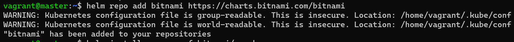
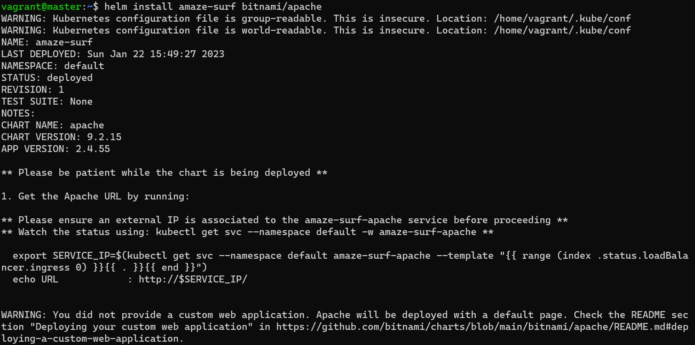
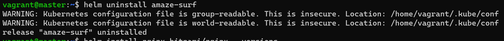
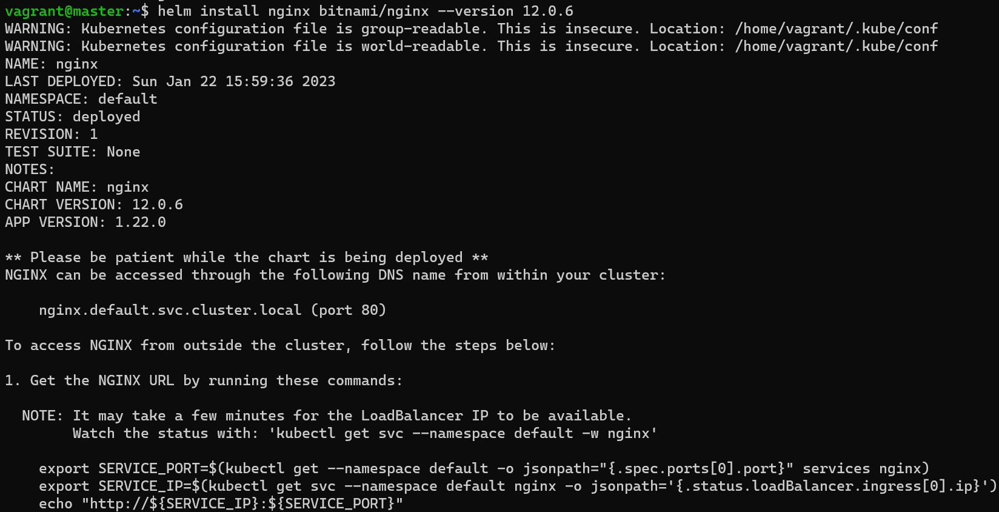
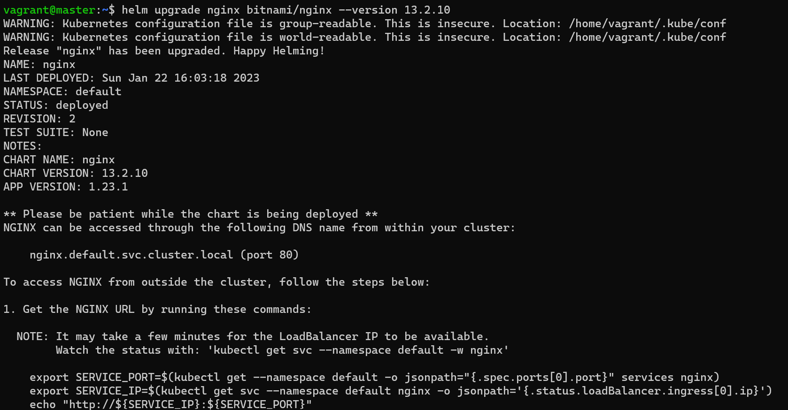
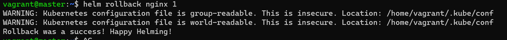

# Helm - Day1

1. Add bitnami helm chart repository in the controlplane node.
    - 
    ```bash
    helm repo add bitnami https://charts.bitnami.com/bitnami
    ```
    

2.  - Deploy the Apache application on the cluster using the apache from the bitnami repository.
    - Set the release Name to: amaze-surf
    ```bash
    helm install amaze-surf bitnami/apache
    ```
    

3.  Uninstall the apache chart release from the cluster
    ```bash
    helm uninstall amaze-surf
    ```
    

4.  - install specfic version of nginx 1.22.0

        - first search for the needed version
        ```bash
        helm search repo nginx --versions
        ```

        - then 
        ```bash
        helm install nginx bitnami/nginx --version 12.0.6
        ```
        

    - then update it to specfic 1.23.1
        ```bash
        helm upgrade nginx bitnami/nginx --version 13.2.10
        ```

        

    - then rollback
        ```bash
        helm rollback nginx 1
        ```

        


