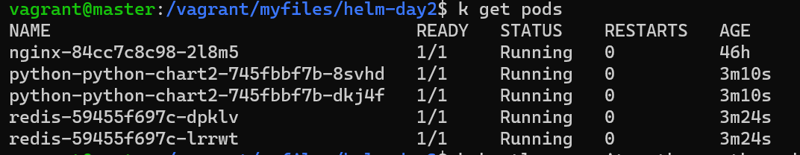
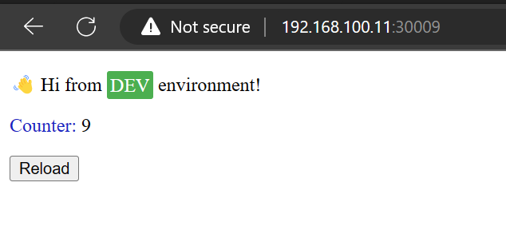

# Helm Day2 - Task
```
1- create python chart (including deployment+svc++configmaps+ingress)
2- create redis chart (include deployment+svc+configmaps)

Send screenshots from the running K8s objects + 2 charts
```

## Get Started 

1.  - need a docker file to build and push it to your docker hub
        ```Dockerfile
        FROM python:3.6-alpine

        WORKDIR /app

        ADD . .

        RUN pip install -r requirements.txt

        CMD ["python", "hello.py"]
        ```

<br/>

2.  - Create Helm Chart for python
        ```bash
        helm create python-chart2
        ```
    - Change needed files as in python-cart2 file

<br/>

3.  - Create Helm Chart for redis
        ```bash
        helm create redis
        ```
    - Change needed files as in redis file

<br/>

4.  - Install redis chart first
        ```bash
        helm install redis ./redis
        ```
    - Then install python chart
        ```bash
        helm install python ./python-chart2
        ```


## Sample Output

- .
- 
- 